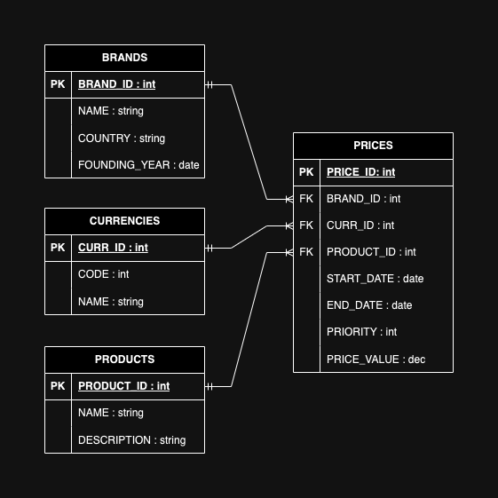

<br>

# [Inditex Pricing Test API](https://github.com/franmastucci/inditex-pricing-test-api)
#### Price retrieval service in a testing context for the company Inditex.
#### Author: [Francisco Mastucci Silva](https://www.linkedin.com/in/franmastucci/).
<br>

## Overview
<b>
The Inditex Pricing Test API is a microservice designed using the Hexagonal Architecture, tailored for the specific needs of the Spanish company Inditex. This microservice aims to fulfill the technical assessment requirements within the context of the selection process.
The architecture of the Inditex Pricing Test API is built upon archetypes, patterns, and practices that the developer has accumulated throughout their professional journey, working with differents companies. Therefore, both the architecture itself and the underlying semantics represent just one approach to harnessing the benefits of a Hexagonal Architecture.
</b>
<br>

## Components
The microservice is structured into three main components:

### [1. Core](core/src/main/java/com/inditex/pricing/application/impl/GetPriceImpl.java)
The Core component encapsulates the application's domain. It implements the business logic and exposes ports for interaction with other components. In this component, the essence of the application's domain is captured.


### [2. Infra](infra/src/main/java/com/inditex/pricing/adapter/PriceRepositoryImpl.java)
The Infra component is responsible for implementing the infrastructure while adhering to the definitions provided by the Core component. It translates the high-level abstractions of the Core into concrete implementations, managing data access, and external interactions.


### [3. Web](web/src/main/java/com/inditex/pricing/adapter/PriceController.java)
The Web component serves as the entry point for external interactions. It exposes web resources that allow clients to invoke the services provided by the microservice. This component acts as the interface between the microservice and external systems


## Why Hexagonal Architecture?
The choice of a Hexagonal Architecture for the Inditex Pricing Test API is driven by several considerations:

1. **Separation of Concerns:**
   Hexagonal Architecture enforces a clear separation between the business logic and external concerns, making the system more modular and maintainable.

2. **Testability:**
   The architecture facilitates comprehensive testing by allowing easy isolation of components for unit testing and mocking.

3. **Adaptability:**
   The hexagonal structure enables the system to be more adaptable to changes, as modifications in one area do not necessarily impact others.

4. **Readability and Maintainability:**
   The architecture promotes clean code practices, enhancing code readability and making maintenance more straightforward.

<br>

## API Quickstart

```bash
mvn clean install
cd web
mvn spring-boot:run
```

## Running Tests

```bash
mvn test
```


## Data Model & Storage

#### **[H2 Console access](http://localhost:8080/h2-console)**.



## API Endpoints
#### [Swagger access](http://localhost:8080/swagger-ui/index.html#/).


| Path                                                        | Type | Description                                                 |
|:------------------------------------------------------------|:-----|:------------------------------------------------------------|
| /prices?product={product_id}&brand={brand_name}&date={date} | GET  | Retrieves prices for a specific product and brand at a given date and time |
#### Invoking the Price service:

The service can be invoked using a client URL command as illustrated below.
```curl
curl --location 'http://localhost:8080/prices?product=35455&brand=ZARA&date=2020-06-16%2021:00:00'
```

####  Using Postman 
Also the API endpoint can be tested by running http calls with Postman. Use this 
[Collection](web/etc/postman/inditex.postman_collection.json)  to  import in a Postman enviroment.

## Technology
* **Platform:** Java 11
* **Project type:** Microservice

  <br><br>
